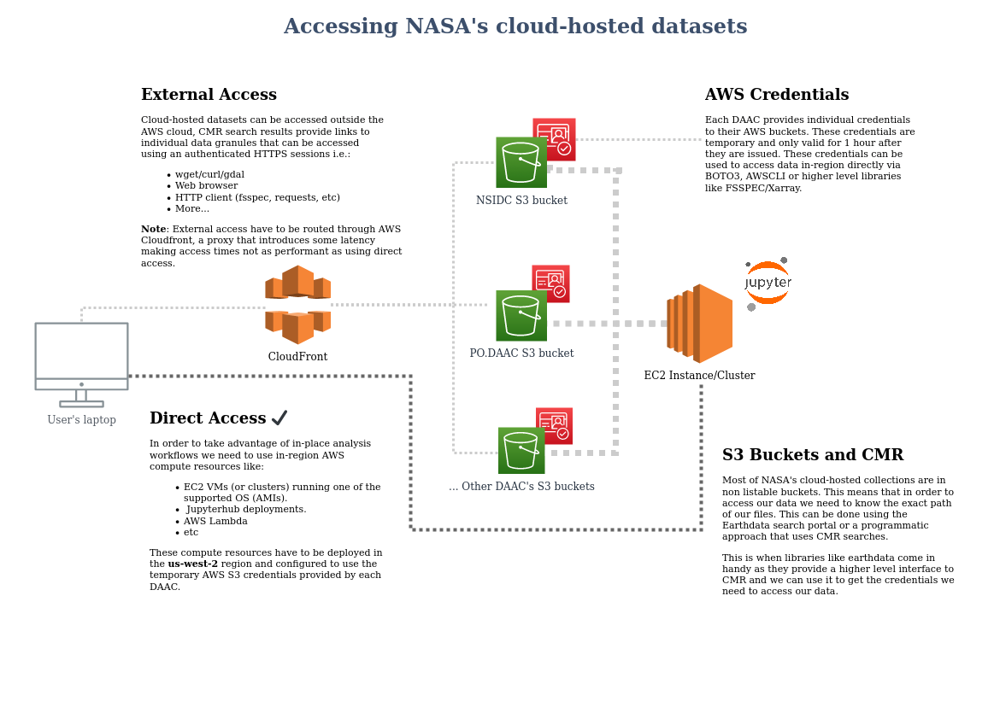

# POC for a fsspec back-end that supports NASA's EDL


# Background motivation

Python access patterns for NASA datasets behind [Earth Data Login](https://urs.earthdata.nasa.gov/), copied from our [overview.md](https://github.com/NASA-Openscapes/edlfs/blob/dev/docs/overview.md): 

## The issue

[`xarray`](https://docs.xarray.dev/en/stable/) has become the defacto library to access multidimensional data in Python. Used along with the [Pangeo stack](https://pangeo.io/), (`Dask` in particular) unlocks the potential to more efficient and scalable workflows for geospatial data analysis. `xarray` and `Dask` really shine when our data is gridded (processing level 3 and above), in a cloud optimized format and publicly available (not auth wall).  Examples of this can be found in the [Pangeo gallery](http://gallery.pangeo.io/) where TB of data can be processed with simpler code using horizontally scalable infrastructure. 

When earth scientists see the examples in the Pangeo gallery [they often think about using them with NASA datasets](https://discourse.pangeo.io/t/cloud-computing-using-nasa-earthdata-with-earthdata-login/2434). However most of NASA's Earth datasets are not in a cloud optimized format and are behind NASA's [EDL](https://urs.earthdata.nasa.gov/) (Earth Data Login). 

The main technical issue with EDL is that `xarray` and `Dask` the core components of the Pangeo stack use a package called [`fsspec`](https://filesystem-spec.readthedocs.io/en/latest/index.html) to access files over HTTP and `fsspec` does not support OAuth2 out of the box. With local files this is not an issue but when we want to open files behind EDL over the network we run into problems, especially if we want to use a distributed Dask cluster.

Another aspect of data usability is that NASA supports different patterns for cloud-based datasets that introduce some complexity as users have to think about tokens, temporary keys and expiration times. This [white paper](https://docs.google.com/document/d/18GyoMZj0I2HKAXwqyeziO0ISbOwHxo1TN4eAlR4mH3U/view#heading=h.ii2k4b5recft) by Patrick Quinn and others expands on some of these issues and potential solutions. Making cloud hosted data more accessible is very important as NASA is migrating their whole catalog to AWS and eventually will be the only supported distribution.

This diagram tries to put the different cloud hosted dataset access patterns into context:




Code examples:

```python
import xarray as xr

file = "https://data.nsidc.earthdatacloud.nasa.gov/nsidc-cumulus-prod-protected/ATLAS/ATL08/005/2018/10/14/ATL08_20181014001049_02350102_005_01.h5"
# will this work?
ds = xr.open_dataset(file, engine="h5netcdf")
ds
```


## Potential solutions


Pre-signed `aiohttp` sessions and leveraging the Thing Egress App (TEA)


TODO: expand on this and start developing a new back-end for fsspec 

### Collaborators

Feel free to add your name here.


